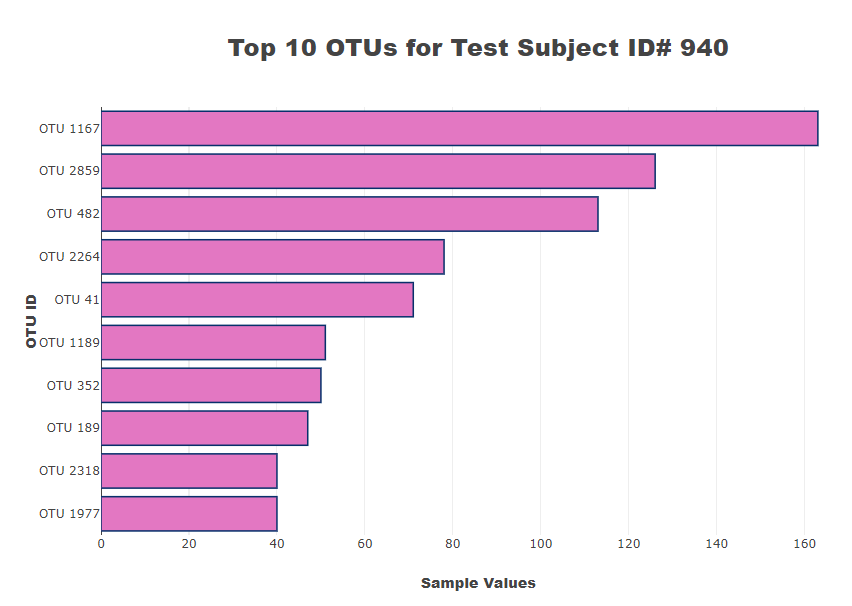
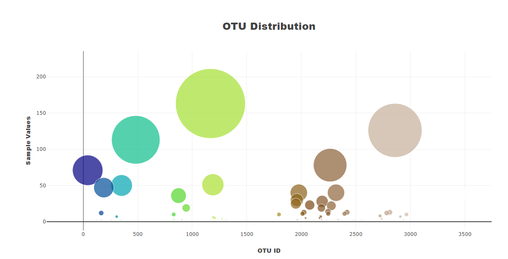
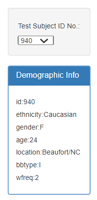
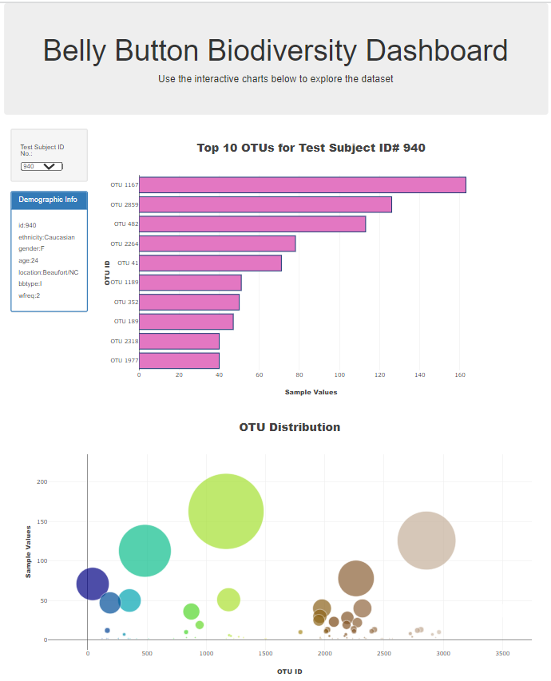
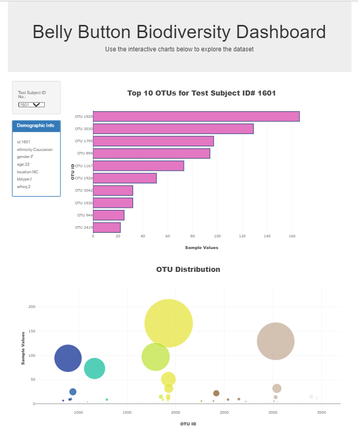

# belly-button-challenge

# Overview
* In this assignment, we built an interactive dashboard to explore the Belly Button Biodiversity.

*Dataset Links to an external site., which catalogs the microbes that colonize human navels. The dataset reveals that a small handful of microbial species (also called operational taxonomic units, or OTUs, in the study) were present in more than 70% of people, while the rest were relatively rare.

# Methodology

* Used the D3 library to read in samples.json from the URL: 
    https://2u-data-curriculum-team.s3.amazonaws.com/dataviz-classroom/v1.1/14-Interactive-Web-Visualizations/02-Homework/samples.json.

### Created Horizontal Bar Chart 
* Created a horizontal bar chart with a dropdown menu to display the top 10 OTUs found in that individual.
    * Used sample_values as the values for the bar chart.
    * Used otu_ids as the labels for the bar chart.
    * Used otu_labels as the hovertext for the chart.
* 

### Created Bubble Chart 
* Created a bubble chart that displays each sample.
    * Used otu_ids for the x values.
    * Used sample_values for the y values.
    * Used sample_values for the marker size.
    * Used otu_ids for the marker colors.
    * Used otu_labels for the text values.
* 

### Individual's Demographic Information Table 
* Displayed the sample metadata, i.e., an individual's demographic information.
* Displayed each key-value pair from the metadata JSON object somewhere on the page.

### Rendered Interactive Dashboard
* Updated all the plots when a new sample was selected. An example dashboard is shown as follows:

* Deployed the app to GitHub Pages. 

References
Hulcr, J. et al. (2012) A Jungle in There: Bacteria in Belly Buttons are Highly Diverse, but Predictable. Retrieved from: http://robdunnlab.com/projects/belly-button-biodiversity/results-and-data/
